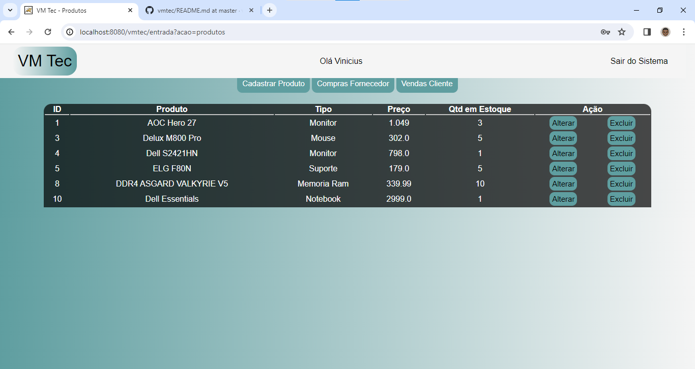

<h1 align="center">VM Tec</h1>

Projeto prático em Sistemas - Turma 35 (terça-feira - noite)

Vinicius Matheus G. De Souza RA: 2222100403

Carlos Eduardo RA: 2222106602

Objetivo do Sistema: Controle de Estoque

  
[VM Tec - Link do vídeo no Youtube](https://youtu.be/Atat067Pf8o)

<h2 align="center">Login</h2>

<h2 align="center">Produtos</h2>

Professor humildemente, nós Vinicius e Carlos pedimos para que o senhor considere o nosso projeto, ao decorrer do semestre tivemos diversos problemas com o nosso grupo, onde só nos dois estavamos realizando as atividades combinada para o projeto. Nas reuniões as pessoas nem apareciam, mais eles diziam que estavam fazendo. Na metade do mês novembro percebemos que só nós estavamos realizando o projeto, então tivemos que optar em fazer um novo projeto do zero. Conseguimos fazer, porem tivemos multa dificuldade para colocar em um servidor Cloud, estamos tentando pela AWS como o senhor solicitou, mais não estamos sabendo configurar. Ainda estamos tentando, e assim que nós conseguirmos iremos lhe enviar o link para o senhor acessar. Pedimos humildemente que você considere nosso projeto, obrigado!

